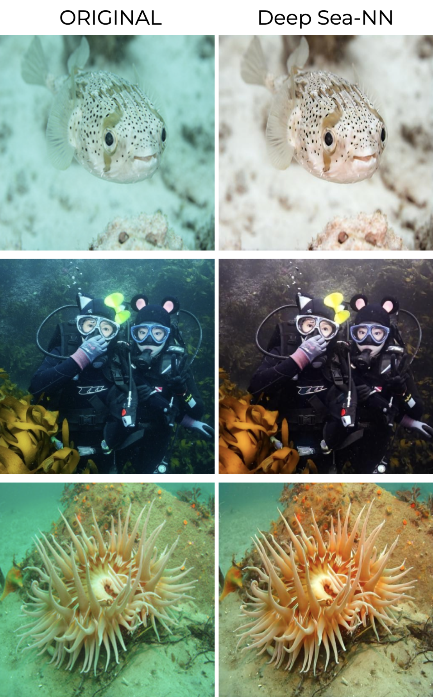

# Sea-NN
Enhancing underwater images using a customized U-Net architecture forreal-time color correction applications.

---

Customized U-Net architecture inspired by [UWGAN: Underwater GAN for Real-world Underwater Color Restoration and Dehazing](https://arxiv.org/abs/1912.10269).

Usage of U-Net for image-to-image-translation inspired [Image-to-Image Translation with Conditional Adversarial Networks](https://arxiv.org/abs/1611.07004).

## Overview

(Enter Result Comparison images)

## Background

## Dataset

Dataset from U of Minnesota's [EUVP(Enhancing Underwater Visual Perception) dataset](https://irvlab.cs.umn.edu/resources/euvp-dataset).
- 3700 Paired Underwater ImageNet + 1270 for validation
- 2185 Paired Underwater Scenes + 130 for validation

## Results

Many more results shown below. All images are of size 512x512.

